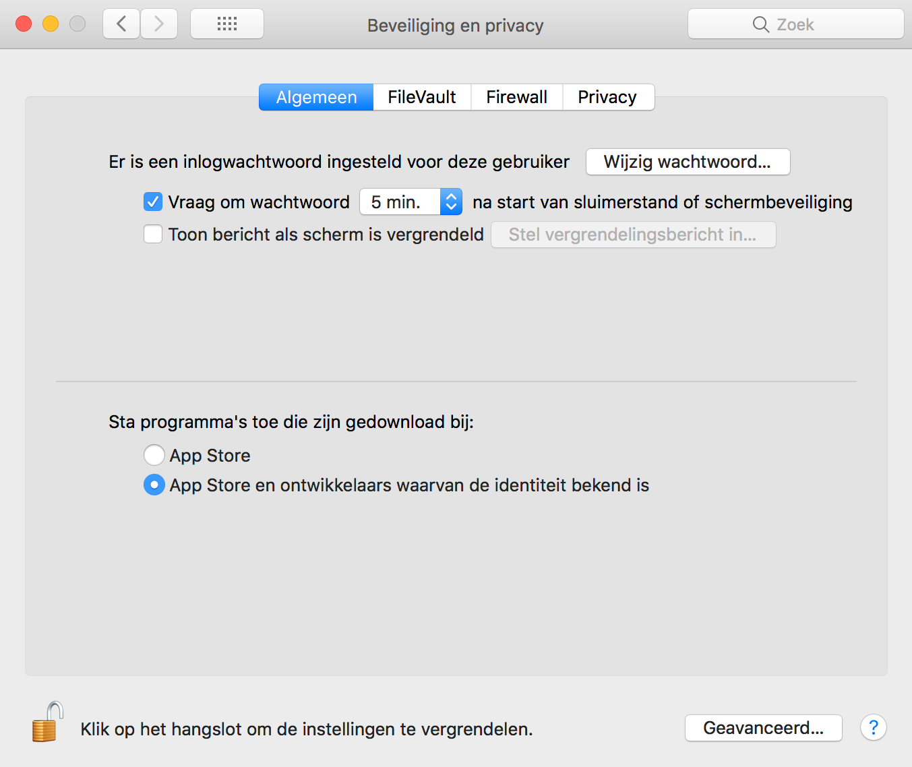
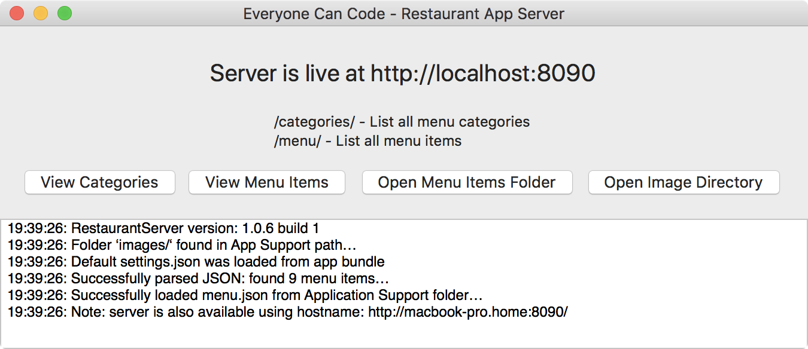

# EveryoneCanCode - Guided Project / Restaurant

For the Restaurant project in Chapter 5 students need a small server app (see §5.7). 
We ran into problems with the orginal app so we decided to create a macOS app using Swift 4 ourselves. There is a Python-based server replacement but the problem is that one needs to at least have a little Python experience, also the Everyone Can Code book shows screenshots of the app as is and we tried to keep our app close to it. 
 
Some info on how the app works (intended for Swift Teachers):
- menu.json (as provided by Apple Inc.) comes with the app as part of the App bundle
- when you start the app for the first time you will get a warning because you download the app from internet, it won't open unless you allow it using to be opened using the "Privacy & settings" screen (shown in Dutch below:)

- menu.json will be copied to the Shared Application folder (Application Support), if you press "Open Menu Items Folder" (see below) you will directly end up in the Application Support folder and should see the menu.json file that the students can edit (using some editor like Atom, Coda or just Xcode).

- the Console gives feedback on what happens inside the app
- you should be able to access your server by going to http://localhost:8090/
- the "View Categories" button should open http://localhost:8090/categories/ (a computed subset of menu.json)
- the "View Menu Items" button should open http://localhost:8090/menu/ (the entire content of menu.json)

## On changing the server address:
The app starts a HTTP server on port 8090 (default), if you open the App bundle you will also see a settings.json, you could change the port there (restart app to make the change work). This is especially useful in the unlikely case that there is already some server running on port 8090.

## On hosting the Restaurant server:
You (read: your students) should also be able to access the server using your local IP address on port 8090 (e.g. http://192.168.0.200:8090/) or even by using your hostname (we show it in your console so your students could use your server in case they are all in the same local subnetwork as you).

Note: you can add the main HTML content (rootHTML) by editting the settings.json in the App bundle. There is also a flag in there (showHostname) to hide your hostname from the console.

<<<<<<< HEAD
## Versions

V1.0.2 is in-line with the OrderApp from the Teachers' materials, we have made some minor changes to the suggested OrderApp (also in this repo) to make it less
crude (especially the images part).
Version 1.0.2 does not provide any images (although one could add image URL's to the menu.json file for menu items). For now we have not implemented ordering either.

V1.0.3 Has implemented the order functionality as well. Ordering now gives back an estimate of the preparation time (see the magical function for that in the ServerApp), would be better to have an estimated preparation time per menu item but Apple did not provide it, so this was left-out as well. 

V1.0.4 Images now work! They are loaded from the Application Bundle (for now).
The update will allow you to load images using:
http://localhost:8090/images/
So e.g. for item 8, 8_Pizza_Vesuvio.png in the menu.json file will allow you to load http://localhost:8090/images/8_Pizza_Vesuvio.png

V1.0.5 If you add a folder called "images" to your Application Support folder, the server will serve images from there instead of the bundle. If the images folder is found in your Application Support folder this also enables the "Open Image Directory" button from the interface. This allows more novice Swift users to easily modify images etc. without the need to dive into the RestaurantServer application bundle themselves. All images are "686 x 334" for now.
